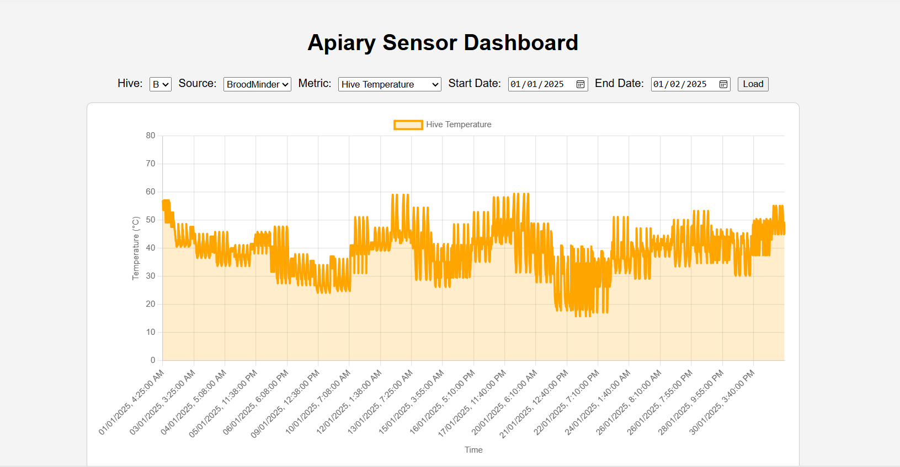
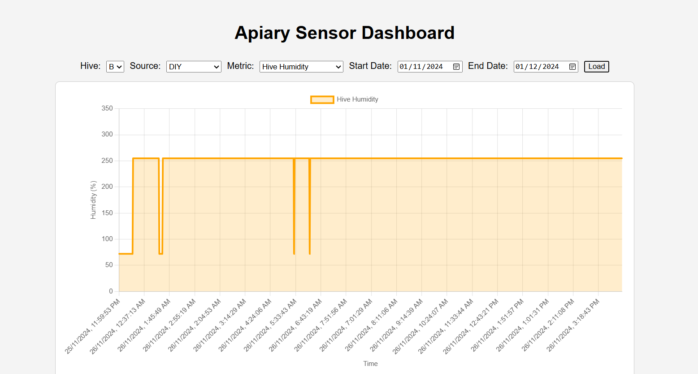
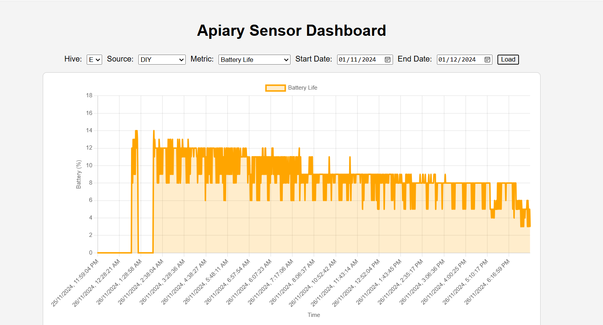
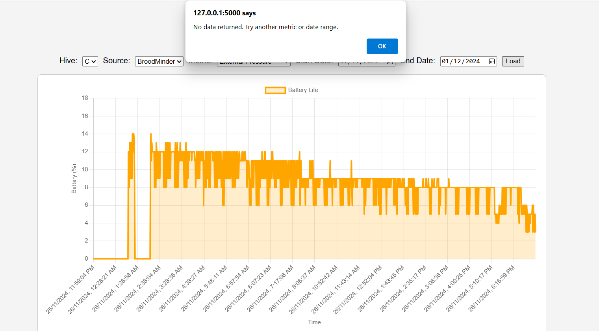
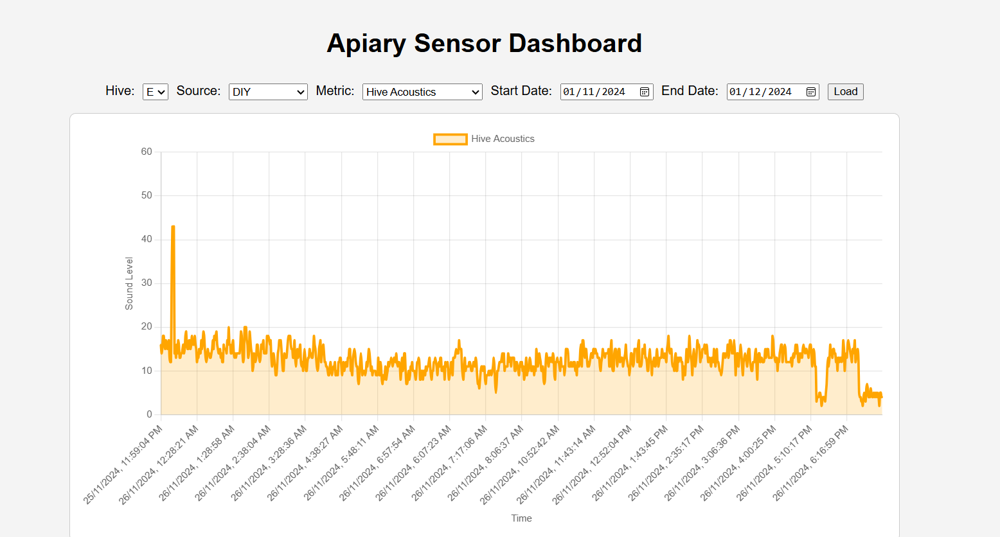

# Apiary Sensor Dashboard 

## Summary 

### Data Modeling & Import (BroodMinder + DIY)

- Created MongoDB time series collections for:
  - `broodminder_ts`
  - `diy_sensor_data_reshaped`
- Used Python and MongoDB scripts to reshape, import, and verify data.
- DIY sensor data was fetched via API and converted into `metric/value` time series format.

### Visualization Dashboard

- Built a web app using **Flask** + **Chart.js**.
- UI lets users select:
  - **Hive** (B, C, E)
  - **Source** (BroodMinder / DIY)
  - **Metric** (Temperature, Humidity, Acoustics, etc.)
  - **Start and End Date**
- Features:
  - Responsive canvas charts
  - Dynamic graph loading
  - Dropdown filters
  - Clean and minimal styling

### Bug Fixes & Enhancements

- Fixed dynamic chart rendering issues
- Ensured metric selection works across sources
- Controlled zoom/stretch effects in graphs
- Improved error handling and UX for empty datasets

---

## Bonus Points Requested: 3

- Completed requirements for 2 points:
  - Proper data modeling and import for both BroodMinder and DIY
  - Visual dashboard to explore time series trends
- Additional features for the 3rd point:
  - Metric + Source switching with dropdown filters
  - Multi-hive support
  - Eventual extensibility for future sensor types

---

## Screenshots of Visualizations

